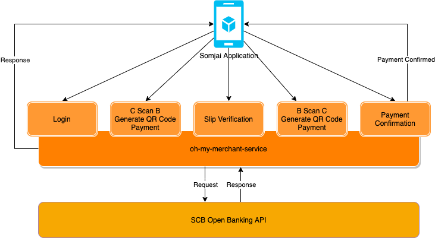

# oh-my-merchant-service

## What is this project?



This is just a POC of the service that uses the [SCB Open Banking API Document](https://developer.scb/) to

- Login and generate the token.
- Create a QR code for payment (C Scan B).
- Slip Verification.
- B Scan C payment.

We recommended using with [Somjai Application](https://github.com/iamgique/somjai-application).

The project structure was inspired by rails.

## System requirements

- Node v12.16.2

## Dev requirements

- [Postman](https://www.postman.com/) - for testing an endpoint.
- [ngrok](https://ngrok.com/) - for exposing the local service to a public URL.
- [nvm](https://github.com/nvm-sh/nvm) - for switching between node versions.

## Setup and config

To start the system, you need to create an account and the app in [SCB Open Banking API Document](https://developer.scb/), because we need several fields such as `API_KEY`, `API_SECRET`, `BILLER_ID`, `MERCHANT_ID`, `MERCHANT_TERMINAL_ID`.

### Config the service

After we registered an account and created an application in https://developer.scb/.
We'll need to config several fields that we mention above.

To start, just copy `.env.example` to `.env` and change the field that has the prefix `<Your ...>` to yours.

```bash
# Application
SCB_API_KEY=<Your API KEY>
SCB_API_SECRET=<Your API SECRET>
SCB_API_BASE_URL=https://api-sandbox.partners.scb # No need to change

# Biller Information
SCB_BILLER_ID=<Your Biller ID>

# Merchant Information
SCB_MERCHANT_ID=<Your Merchant ID>
SCB_MERCHANT_TERMINAL_ID=<Your Terminal ID>
```

### Start a development server

The development server is including the `debug` log that we do not include in production mode.

```bash
$ yarn dev
# or
$ npm run dev
```

### Start a server

```bash
$ yarn start
# or
$ npm run start
```

## Production deployment

In the demonstration, we are using the [Heroku](https://www.heroku.com/) to deploy and do CI/CD.

To use a project in production, we have many concerns, for example, some request body validation, validation token, and database to store a transaction id or token.
You'll need to put some effort to make it ready to use in production.

We recommended reading the [Futher reading](#Futher-reading) section.

## Postman collection

Postman collection available here, [docs/postman](./docs/postman)

## Further reading

### Express

- [Production Best Practices: Security](https://expressjs.com/en/advanced/best-practice-security.html)
- [Production best practices: performance and reliability](https://expressjs.com/en/advanced/best-practice-performance.html)

### SCB Open Banking API

- [SCB Open Banking API Document](https://developer.scb/)
- [สร้าง Payment Chatbot ด้วย SCB Open Banking API (Part 1 : มาส่อง API ของธนาคารไทยพาณิชย์ไปพร้อมกัน)](https://medium.com/@aijo/%E0%B8%AA%E0%B8%A3%E0%B9%89%E0%B8%B2%E0%B8%87-payment-chatbot-%E0%B8%94%E0%B9%89%E0%B8%A7%E0%B8%A2-scb-open-banking-api-part-1-ac1095e76ec9)
- [สร้าง Payment Chatbot ด้วย SCB Open Banking API (Part 2 : เตรียม Chatbot ของเราให้พร้อม)](https://medium.com/@aijo/%E0%B8%AA%E0%B8%A3%E0%B9%89%E0%B8%B2%E0%B8%87-payment-chatbot-%E0%B8%94%E0%B9%89%E0%B8%A7%E0%B8%A2-scb-open-banking-api-part-2-2dc3cc20c83b)
- [สร้าง Payment Chatbot ด้วย SCB Open Banking API (Part 3 : เขียน Fulfillment เพื่อสร้าง Payment Deeplink)](https://medium.com/@aijo/%E0%B8%AA%E0%B8%A3%E0%B9%89%E0%B8%B2%E0%B8%87-payment-chatbot-%E0%B8%94%E0%B9%89%E0%B8%A7%E0%B8%A2-scb-open-banking-api-part-3-161bdc0aa64b)
- [สร้าง Payment Chatbot ด้วย SCB Open Banking API (Part 4 : ส่ง Push Message จาก Payment Confirmation)](https://medium.com/@aijo/%E0%B8%AA%E0%B8%A3%E0%B9%89%E0%B8%B2%E0%B8%87-payment-chatbot-%E0%B8%94%E0%B9%89%E0%B8%A7%E0%B8%A2-scb-open-banking-api-part-4-a84034306ee1)
- Most response codes are copied from [Generic Response Codes](https://developer.scb/#/documents/api-reference-index/references/generic-response-codes.html.)

### Socket.io

- [Emit cheatsheet](https://socket.io/docs/emit-cheatsheet/)

### Heroku

- [Deploying Node.js Apps on Heroku](https://devcenter.heroku.com/articles/deploying-nodejs)
- [Configuration and Config Vars](https://devcenter.heroku.com/articles/config-vars)

---

Made with ❤️ by Ayuth Mangmesap.
